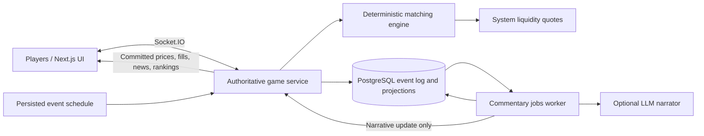

# DinoPump — Project Specification

Version: 1.0  
Status: Proposed implementation baseline  
Product: A fictional, dinosaur-themed multiplayer market game  
Working title: DinoPump

## 1. Product definition

DinoPump is a browser game in which 2–8 players trade invented prehistoric assets during a shared, ten-minute market round. Players react to volcanic eruptions, migrating herds, fossil discoveries, and other fictional events to grow their virtual portfolios. The player with the highest portfolio value when the market closes wins.

The experience combines the information density of a simplified trading terminal with playful dinosaur characters, readable charts, and fast decisions. The market is authoritative, deterministic, and controlled by the server. An optional LLM adds entertaining commentary from verified game facts; it has no authority over game state.

This document defines the MVP and its acceptance criteria. Values marked as defaults are initial balancing choices, configurable before a round and frozen for that round. Future features are explicitly outside MVP scope.

### Product boundaries

- All assets, companies, headlines, and currency are fictional.
- Currency is called **Dino Dollars**, displayed as `D$`. It cannot be bought, withdrawn, transferred outside a round, or redeemed.
- No brokerage integration, real securities, cryptocurrency wallets, deposits, payouts, leverage, borrowing, or short selling.
- The lobby and game interface display: “Fictional market game. Virtual currency only.”
- Player-facing language uses “play,” “round,” and “virtual portfolio”; it must not promise real financial returns.

### Success criteria

- A first-time player can join a lobby and place a first trade within two minutes without reading external documentation.
- Players see a consistent shared market and can explain why their cash, holdings, and ranking changed.
- A complete round works even when the commentary provider is unavailable.
- Eight simultaneous players can complete a round with no negative balances, duplicated trades, or divergent authoritative state.

## 2. MVP scope

| Included | Deferred |
| --- | --- |
| One active room, 2–8 human players | Multiple concurrent rooms, matchmaking, tournaments |
| Guest identities and reconnectable sessions | Accounts, long-term profiles, progression |
| Four fictional assets | Player-created assets and new asset classes |
| Ten-minute rounds and a results screen | Alternate round lengths and game modes in the UI |
| Buy/sell market orders | Player limit orders and cancellations |
| A deterministic liquidity bot | Multiple bot strategies and advanced AMMs |
| Executable bid/ask quote ladder | Full player-driven order book UI |
| Live line charts and recent trades | Candlesticks and advanced indicators |
| Cash, holdings, P/L, live leaderboard | Teams, achievements, analytics dashboards |
| One market event every 60 seconds | Complex event chains and boss modes |
| LLM commentary with template fallback | Conversational AI analyst |
| Preset trader reactions | Free-text chat, moderation, direct messages |
| An event log and internal state reconstruction | Player-facing replay controls |

Player-to-player limit matching is a later phase. In the MVP, human market orders execute against system bot quotes. Market orders alone do not provide resting liquidity; the bot is therefore a required dependency, not an optional enhancement.

## 3. Theme and assets

The setting is **Pangaea Exchange**, a prehistoric marketplace operated by cartoon dinosaurs. News comes from a fictional broadcaster, **The Daily Roar**. The tone is witty and energetic, with no requirement for scientifically accurate coexistence of species.

| Symbol | Asset | Description | Initial reference and last price |
| --- | --- | --- | ---: |
| FERN | Fern Farms | Food for hungry herbivore herds | D$40.00 |
| AMBR | Amber Works | Collectible amber and trapped ancient treasures | D$75.00 |
| VOLC | Volcano Energy | Geothermal power from unpredictable volcanoes | D$100.00 |
| BONE | Fossil Finds | Excavations and rare fossil discoveries | D$25.00 |

Example events:

- “A brachiosaurus herd discovers Fern Farms’ all-you-can-eat valley.”
- “Fresh amber deposits uncovered beneath the Triceratops tram line.”
- “Volcano Energy shuts down a vent after an unusually dramatic sneeze.”
- “Fossil Finds announces a record dig. Paleontologists demand a recount.”

Each catalog event has fixed affected symbols, integer reference-price changes in basis points, a factual template, and an illustration/icon identifier. Narrative prose is never parsed into market instructions.

## 4. Player journey and round rules

1. A player chooses a dinosaur avatar and a unique display name, then creates or joins the active room using its code.
2. The lobby shows players, the fictional-currency notice, and a short explanation of buying, selling, and scoring.
3. At least two connected players must mark themselves ready. The host starts a five-second countdown; joining and the participant list then lock.
4. If fewer than two players remain connected before opening, the countdown returns to the lobby. Otherwise the round opens for the locked participants.
5. Each participant begins with **D$10,000.00 cash and zero holdings**. The market remains open for **600 seconds**.
6. Players buy and sell whole units, follow the feed, and monitor their portfolios. New participants cannot join an open round; existing participants can reconnect.
7. Market events occur at elapsed seconds 60, 120, …, 540. There are nine events; no event occurs at the closing boundary.
8. At market close, orders stop, final marks are frozen, and the results screen appears.
9. The host can return the room to the lobby. The next round has a new ID, seed, balances, and readiness state; previous round data remains recorded.

### State machine

`LOBBY → COUNTDOWN → OPEN → SETTLING → FINISHED`

- A failed countdown returns to `LOBBY`.
- An unrecoverable integrity error moves the round to `ABORTED`; it must not declare a winner.
- The host has lobby controls only. Host status gives no trading privileges.
- In the lobby, a disconnected host is replaced after 15 seconds by the earliest-connected remaining player. Empty lobbies expire after five minutes.
- Disconnected round participants retain their cash and holdings and remain ranked. No automatic liquidation occurs.
- An open round continues even if all participants disconnect.

### Scoring

`portfolioValueCents = cashCents + Σ(quantity × finalOrCurrentMarkCents)`

`profitCents = portfolioValueCents − 1,000,000`

`returnPercent = profitCents / 1,000,000 × 100`

The mark is the latest completed trade price, or the initial price if no trade has occurred. Scheduled events can move executable quotes without immediately changing this mark. The UI must distinguish **last trade**, **bid**, and **ask**.

Rank by portfolio value descending. Equal values share a rank; stable display ordering uses join order and does not break the tie. Final holdings are marked, not forcibly sold. Bots are excluded from ranking. Live rankings are provisional because the most recent trade can influence valuation.

## 5. Market and matching rules

### Numeric and execution rules

- Store cash and prices as integer cents, quantities as whole integers, and changes as integer basis points. Do not use floating-point arithmetic for settlement.
- Minimum price: D$1.00. Maximum price: D$10,000.00. Minimum quantity: 1; maximum quantity per order: 500.
- Price tick: D$0.01. Round reference-price calculations half-up to the nearest cent, then clamp to the allowed range.
- No trading fees in the MVP.
- Every order is immediate-or-cancel: fill what can execute within its protections and cancel the remainder. There are no resting human orders.
- Buys consume asks from lowest to highest price. Sells consume bids from highest to lowest price. Equal prices use quote creation sequence, then stable quote ID.
- Each fill executes at the resting quote price. A multi-fill order reports filled quantity, remaining quantity, total value, and volume-weighted average price.
- An order cannot trade with the same owner. Human-to-human matching becomes available when resting human orders are introduced later.

### Price protection and validation

The trade ticket shows an estimate, quote age, and the default **5% maximum price movement**. On submission, the client sends an explicit maximum unit price for buys or minimum unit price for sells, derived from the displayed best quote. This protection is fixed for that request; the server must not silently widen it.

Before processing, the server validates session identity, round ID, round status, asset, side, integer quantity, protection price, rate limits, and idempotency key. A buy must have enough cash for `quantity × maximumUnitPrice`; a sell must have the full requested quantity in holdings. These checks are conservative even when a partial fill is expected.

The engine settles all fills for one order atomically. Unused spending capacity is immediately available after the transaction. Insufficient balance, insufficient holdings, invalid input, and a closed market reject the entire order without fills. Valid orders may partially fill; if no quote qualifies, return `NO_LIQUIDITY_WITHIN_PROTECTION` without changing balances.

### Deterministic liquidity bot

Initial defaults:

- One system bot starts each round with **D$10,000,000.00 cash and 100,000 units of each asset**.
- Each asset has three quote levels per side, each for up to 100 units.
- At reference price `R`, ask levels are `ceil(R × (1 + offset / 10,000))`; bid levels are `floor(R × (1 − offset / 10,000))`, for offsets **100, 200, and 300 basis points**.
- Discard quotes outside price bounds. Bids must remain below asks; at a bound, a side may be empty.
- Quotes are limited by the bot's unreserved holdings and cash. Across all assets, aggregate bid reservations cannot exceed bot cash. Allocate reservations in symbol order, then from best to worst quote.
- Rebuild all bot quotes after each completed human order and each scheduled event. Replacements release old reservations first. Generation IDs and quote ordering are deterministic.
- Quotes stay fixed while an individual order executes. After an order with fills, move the traded asset's reference price by **+10 basis points for a buy** or **−10 basis points for a sell**, once per order, then rebuild quotes.
- The bot does not submit autonomous trades in the MVP. An idle chart may be flat; scheduled events still change quotes and the news feed.

Scheduled events apply their catalog basis-point changes to reference prices, then rebuild quotes. Last-trade prices change only on fills. These are intentionally simple game-balancing rules, not a model of real-world markets.

The bot is a real ledger participant with finite resources. Trades transfer existing cash and units; liquidity must not be fabricated during settlement. Resource exhaustion produces partial fills or unavailable quotes. No mid-round replenishment is part of the MVP.

### Determinism and ordering

- Exactly one authoritative processor owns the room and serializes all market-changing commands.
- Assign server sequence numbers; client timestamps never determine order priority.
- Before handling a player command, process scheduled events already due according to authoritative server time.
- At `serverNow >= closesAt`, settle the round before processing another order. A request sent earlier but processed after this boundary is rejected.
- Persist the round seed, rules version, configuration, event schedule, and selected event outcomes. Reconstructing state must not require an LLM, wall-clock calls, or fresh randomness.
- A command either commits its complete event batch and state changes or makes no changes. Broadcast only after commit.

## 6. Interface specification

### Lobby

Room code, participant avatars, connection/ready indicators, host start button, avatar/name controls, and concise instructions. Explain that trades execute against a game liquidity bot in the MVP.

### Market screen

On desktop, use a three-column terminal layout:

- **Left:** four-asset watchlist, last prices, change since opening, and selected asset.
- **Center:** selected asset line chart, latest event context, recent trade tape, and Daily Roar news feed.
- **Right:** buy/sell ticket, bot bid/ask depth ladder, cash, holdings, portfolio value, and P/L.

A top bar shows the room, server-synchronized round countdown, connection state, and virtual-currency label. A lower panel contains leaderboard, player activity, and preset reactions such as “Big roar,” “Tiny arms, big gains,” and “Meteor incoming.”

On narrow screens, use Market, Trade, Portfolio, and News tabs; keep countdown and connection status visible. The buy/sell ticket must remain usable at a 360px viewport width.

### Interaction requirements

- Show a confirmation/result for every order: filled, partially filled, rejected, or pending reconciliation.
- Disable repeat submission while the same request is pending. Network retries reuse its original request ID.
- A quote estimate is not a guaranteed execution price. Show average fill price and executed total after settlement.
- Show empty states for no holdings, no trades, no news, and unavailable liquidity.
- Disable trading when disconnected, resynchronizing, or outside the open round.
- Mark stale quotes visibly after three seconds without fresh connectivity evidence.
- Chart points come from executed trades plus the initial point. Event markers may appear without an accompanying trade-price move.
- News facts appear immediately; delayed AI copy enhances the same news item without changing its timestamp or market effects.
- Display bot counterparties in trade details and show player activity without exposing session credentials.

### Visual direction and accessibility

Use a dark jungle/volcanic background, amber highlights, fern green accents, clear numeric typography, and restrained cartoon dinosaur art. Charts and trade controls take visual priority over decoration.

All controls support keyboard use and visible focus. Gains and losses use text or icons as well as color. Respect reduced-motion preferences, use readable contrast, and avoid announcing every market tick to screen readers; announce trade results and connection changes.

### Results screen

Show shared ranks, winner or tied winners, final portfolio value, profit, return, remaining cash/holdings, and a compact timeline of major market events. Provide a return-to-lobby action for the host. Full interactive replay is deferred.

## 7. Technical architecture

These are proposed technology choices. Choose and pin supported versions when implementation begins.

| Component | MVP choice | Responsibility |
| --- | --- | --- |
| Web app | Next.js, React, TypeScript | Lobby, dashboard, charts, results |
| Game service | Long-running Node.js/TypeScript process with Socket.IO | Sessions, room commands, realtime transport |
| Engine | Framework-independent TypeScript package | Validation, matching, settlement, deterministic reducers |
| Persistence | PostgreSQL | Sessions, round configuration, event log, projections |
| Event scheduler | Game-service timer backed by persisted deadlines | Apply due events exactly once |
| Commentary worker | Separate worker using a PostgreSQL jobs table | Bounded LLM calls, retries, template fallback |
| Shared schemas | Runtime-validated TypeScript schemas | HTTP/WebSocket contracts and event versions |
| Later scaling | Redis and a dedicated queue if needed | Multi-instance fan-out, presence, job coordination |

Redis is optional infrastructure for later scaling. It is not the source of truth and is not required to operate one MVP room. The game service requires a host that supports persistent WebSocket connections; it should not rely on short-lived request handlers for its clock or in-memory room ownership.



### Suggested repository structure

```text
apps/web/                 Next.js frontend
apps/game-server/         HTTP, Socket.IO, room orchestration
apps/commentary-worker/   Narration jobs and provider adapter
packages/engine/          Pure market logic and event reducers
packages/contracts/       Shared schemas and protocol types
packages/database/        Schema, migrations, persistence helpers
packages/game-content/    Assets, event catalog, templates, rules
tests/integration/        Transaction, reconnect, restart coverage
tests/e2e/                Complete multiplayer round coverage
```

## 8. Persistence and event model

| Entity | Required information |
| --- | --- |
| GuestSession | Player ID, hashed secret, expiry; no raw credential in logs |
| Room | ID/code, host, current round, status |
| Round | Participants, seed, rules/config version, open/close times, status |
| PlayerRoundState | Cash, holdings, connection metadata, projection sequence |
| AssetRoundState | Initial price, reference price, last price, quote generation |
| Order | Request ID, player, side, symbol, quantity, protection, outcome |
| Trade | Buyer/seller IDs, symbol, quantity, unit price, order ID, sequence |
| GameEvent | Round ID, sequence, schema version, type, payload, cause ID, timestamp |
| ScheduledEvent | Due time, catalog ID, fixed effects, applied event ID |
| CommentaryJob | Source event, status, attempts, next attempt time, lease |
| NewsItem | Structured facts, fallback copy, optional generated copy, provenance |
| RoundResult | Frozen marks, player values, shared ranks, settlement sequence |

Representative event types: `RoundOpened`, `OrderAccepted`, `TradeExecuted`, `OrderCompleted`, `OrderRejected`, `ReferencePriceAdjusted`, `QuotesRebuilt`, `MarketEventApplied`, `CommentaryPublished`, `RoundSettled`, and `RoundAborted`. Lifecycle changes also have persisted records. High-volume transient reactions/presence are separate from the market event stream.

Persist valid trading attempts and their outcomes. Malformed and rate-limited transport requests belong in bounded operational logs rather than an unbounded market event log.

### Atomicity and invariants

- A unique constraint on `(roundId, playerId, requestId)` enforces order idempotency. The same request ID with different content returns `IDEMPOTENCY_CONFLICT`.
- Commit the order outcome, fills, balance changes, asset changes, events, and resulting projection sequence in one database transaction.
- A market event's state effects and commentary-job creation commit together.
- Sequence numbers are unique and increasing within a round. Event batches are applied in order; clients never render half a settlement batch.
- Cash and holdings cannot become negative. Bot quote reservations must be covered.
- Total cash and each asset's total units across humans and the bot are conserved after initial round funding. Reference-price changes do not create cash or units.
- Final results are written once and cannot be changed by later commentary or reactions.
- A committed event stream plus its initial configuration reconstructs authoritative market state. Mutable projections are replaceable accelerators.

## 9. API and realtime contract

All commands use runtime validation. The server derives player identity from the session and never trusts a player ID supplied in a payload. Guest sessions use secure, HttpOnly cookies in the same-site deployment; validate WebSocket origin and session expiry. Default session lifetime: 24 hours.

### HTTP surface

- `POST /api/session`: create guest identity and session.
- `POST /api/rooms`: create the active room, or return a clear active-room conflict.
- `POST /api/rooms/:code/join`: join the lobby or reconnect an existing participant.
- `GET /api/rooms/:code/snapshot`: retrieve authorized current room state.
- `GET /api/rounds/:roundId/results`: retrieve results for a participant.
- `GET /healthz` and `GET /readyz`: process health and readiness to serve.

### Socket.IO messages

| Direction | Message | Essential payload |
| --- | --- | --- |
| Client → server | `room:ready` | `ready`, `requestId` |
| Client → server | `round:start` | `requestId` |
| Client → server | `order:submit` | `roundId`, `requestId`, `symbol`, `side`, `quantity`, `protectionPriceCents` |
| Client → server | `reaction:send` | Approved `reactionId` |
| Client → server | `room:resync` | `roundId`, `lastSequence` |
| Server → client | `room:snapshot` | Complete visible state, `sequence`, `serverTime`, deadlines |
| Server → client | `market:batch` | Ordered public changes, start/end sequence, `serverTime` |
| Server → client | `order:result` | Private order status, fills, balances, `requestId`, committed sequence |
| Server → client | `news:update` | Source event ID, facts, copy, narration status |
| Server → client | `presence:update` | Connection/readiness status |
| Server → client | `round:ended` | Immutable results and settlement sequence |
| Server → client | `command:error` | Stable error code, safe message, optional `requestId` |

Every command receives an acknowledgement carrying its request ID and outcome. Public batches contain a complete sequence envelope even when some event details are private; private holdings/order details are delivered only to their owner. Leaderboard portfolio totals and executed trade activity are public within the room.

### Recovery behavior

- The browser reconnects automatically with backoff, then requests a fresh snapshot before enabling trades.
- Socket reconnection alone is not proof that no messages were lost. A sequence gap, reordered batch, or round ID change triggers resynchronization.
- The snapshot includes the player's recent order outcomes so a pending order can be reconciled. A timed-out submit retries the same ID; it never creates a second order.
- Capture the snapshot at sequence N and deliver only subsequent buffered batches after it, avoiding a subscribe/snapshot race.
- After restart, rebuild from committed data and process overdue scheduled events in due-time order before accepting commands. If closing time has passed, process events due strictly before close, then settle. Server outages do not extend the round.
- Use a database ownership lock to prevent two game processes from operating the same room. Loss of ownership or database availability disables writes and trading until safe recovery.

## 10. Scheduled events and AI narration

### Event authority

At round creation, a seeded selection produces the full event schedule from a versioned catalog. Default individual shocks range from −1,500 to +1,500 basis points. Each scheduled event has an ID, due time, affected symbols, fixed effects, and fictional facts. Selection and effects are recorded before the round opens.

The scheduler applies effects exactly once, updates reference prices and quotes, publishes the factual template immediately, and enqueues narration. A commentary failure must never delay or roll back a market event.

### Narrator contract

Input includes only approved game facts: fictional asset names, catalog event description, actual reference-price effect, and separately labeled observed trade statistics. Exclude session secrets, raw user text, and unnecessary player data.

Output is schema-validated JSON with `headline` (maximum 100 characters) and `commentary` (maximum 400 characters). Use a playful dinosaur-news style. Do not invent completed trades, confuse quote changes with last-trade changes, issue real-world recommendations, or imply external facts.

- Default provider timeout: five seconds; at most two attempts per event.
- Failed, invalid, unsafe, or unavailable output leaves the authored template in place.
- Generated text is rendered as plain text, labeled “AI narration,” and tied to its source event.
- Retrying a job updates the same news item rather than producing a duplicate item.
- The worker's database role can access narration inputs/jobs and write commentary; it cannot change balances, quotes, trades, reference prices, or results.
- The LLM has no trading tools and cannot emit accepted game commands. No executable HTML or scripts are permitted in commentary.
- Save provider/model identifier, prompt version, duration, and validation outcome for debugging. The round must be fully playable without an API key.

## 11. Performance, integrity, and operations

MVP acceptance targets assume eight connected players and up to five submitted orders per player per second in the deployment region. Record the test environment when reporting results.

| Area | Target or rule |
| --- | --- |
| Order acknowledgement | p95 under 300ms, excluding client internet latency |
| Realtime delivery | p95 under 500ms from commit to connected clients in the test environment |
| Initial room snapshot | Under one second in the test environment |
| Scheduler accuracy | Within one second of due time under healthy operation |
| Order rate limit | Five/second/player with a burst of ten; reject excess before engine work |
| Reactions | One/second/player; approved identifiers only |
| Identity | Display names 2–20 characters, normalized and unique within the room |
| Session/access controls | Validate ownership and room membership for every command and snapshot |
| Integrity | No negative balances, duplicate fills, or partial transaction publication |
| Logging | Structured room, round, request, sequence, and job IDs; no session secrets |
| Metrics | Connected players, order latency/rejections, scheduler lag, DB failures, narration failures |

MVP manipulation controls are limited to no self-trading, no shorting, transaction limits, server authority, and an auditable log. Sophisticated collusion detection and manipulation-resistant closing marks are future work. Public competitive tournaments are outside this baseline.

## 12. Verification and acceptance criteria

Use pure engine tests for deterministic rules, database integration tests for atomicity/recovery, and browser tests for the player journey. Test seeded command sequences and boundary cases rather than only mirroring implementation functions.

| ID | Required acceptance criterion |
| --- | --- |
| AC-01 | Two to eight guests can enter a lobby; a ninth is rejected; an open round rejects new participants. |
| AC-02 | A valid start initializes exactly four assets, D$10,000 per player, and the configured bot resources once. |
| AC-03 | A buy fills the cheapest eligible asks and updates buyer and bot ledgers correctly. At asks D$40.40 and D$40.80, buying 150 units fills 100 and 50 for D$6,080.00. With a D$41.00 protection, buyer cash becomes D$3,920.00. |
| AC-04 | Selling owned units fills highest eligible bids and transfers the exact cash and units; overselling and underfunded buys have no ledger effects. |
| AC-05 | Invalid values, unknown assets, unauthenticated commands, and closed-round orders are rejected with stable codes. |
| AC-06 | Price protection produces correct full, partial, and zero-fill outcomes; no fill violates the submitted protection. |
| AC-07 | Duplicate requests, including retries after restart, return the original outcome without additional fills; changed payloads with reused IDs fail. |
| AC-08 | Concurrent submissions are serialized; seeded stress runs preserve cash/unit conservation and all nonnegative-balance invariants. |
| AC-09 | Nine scheduled events apply exactly once and affect only configured reference prices; generated prose cannot alter state. |
| AC-10 | Every client receives consistent market state; reconnecting during a fill resolves pending orders and restores the authoritative snapshot. |
| AC-11 | Closing-boundary orders are handled consistently; rankings match frozen marks; ties share ranks; late commentary cannot change results. |
| AC-12 | Replaying committed events produces identical balances, holdings, reference/last prices, quotes, and final rankings. |
| AC-13 | Narrator timeout, invalid JSON, misleading copy rejection, and missing credentials preserve immediate template news and uninterrupted play. |
| AC-14 | A crash before commit produces no trade; a crash after commit but before broadcast is recovered without duplication. |
| AC-15 | Restart after missed event deadlines catches up in order; restart after close settles once and rejects new orders. |
| AC-16 | Quote reservations never exceed bot resources, including near price limits and deliberately exhausted liquidity. |
| AC-17 | The complete join → ready → trade → event → reconnect → results journey passes in two browser sessions and at a 360px viewport. |
| AC-18 | An eight-client load run meets the stated latency targets and an end-to-end round runs without an LLM key. |

## 13. Implementation milestones

Deliver in dependency order. A milestone is complete only when its behavior can be demonstrated and its relevant acceptance criteria pass.

1. **Foundation and content:** establish the TypeScript workspace, shared schemas, four assets, event catalog, configuration, database migrations, and local setup instructions.
2. **Deterministic engine:** implement bot quotes, protected market orders, atomic settlement, reference changes, marking, and engine tests. Gate: AC-03–08 and AC-16 at engine level.
3. **Authoritative room service:** add sessions, lobby/round lifecycle, persisted command processing, Socket.IO, event scheduling, ownership lock, and recovery. Gate: AC-01–02, AC-07–12, AC-14–15 at service level.
4. **Playable terminal:** implement lobby, market dashboard, trade ticket, chart, portfolio, leaderboard, preset reactions, reconnect states, and results. Gate: AC-10–11 and AC-17.
5. **Narration:** implement immediate templates, jobs worker, provider adapter, output validation, and provenance labels. Gate: AC-09 and AC-13.
6. **Release readiness:** complete the eight-player load run, accessibility review, crash/recovery verification, deployment instructions, and configuration/secrets documentation. Gate: all acceptance criteria.

### MVP definition of done

- A fresh checkout can start the frontend, game service, worker, and PostgreSQL using documented commands and an example environment file.
- Two browsers can complete the full round; an eight-player test has been recorded.
- All required acceptance criteria pass, with results and known limitations documented.
- No external AI credential is required for core gameplay.
- The deployed services support persistent connections and recovery from committed state.
- The fictional nature of the assets and currency is visible throughout the player experience.

## 14. Post-MVP roadmap

**Phase 2 — Player-driven exchange:** limit orders, cancellation, reserved funds/holdings, price-time priority across human and bot orders, a real order book, candlesticks, and expanded trade history. Resting orders require dedicated cancellation and reservation-release tests.

**Phase 3 — Deeper game:** new asset categories, achievements, curated event chains, team rooms, multiple bot personalities, and more sophisticated supply/demand rules. Version rule changes per round.

**Phase 4 — Competitive and social:** persistent accounts, multi-room routing, tournaments, approved player-created assets, abuse detection, and moderated chat. Revisit scoring and market manipulation before competitive rewards.

**Phase 5 — Explainability and replay:** interactive replay from the event store, shareable round highlights, and an AI analyst whose explanations cite actual event IDs and recorded trades.

## 15. Baseline decisions

To avoid blocking implementation, this specification assumes browser delivery, guest play, one active room, ten-minute rounds, whole units, no fees, zero starting holdings, and bot-provided liquidity. Next.js plus a separate long-running Node service is the proposed stack. Hosting provider, charting library, and LLM provider can be selected during implementation without changing the gameplay contract.

Any change to settlement, rounding, scheduling, quote generation, or scoring must update the rules version, this specification, and the applicable acceptance cases before being used in a new round.
