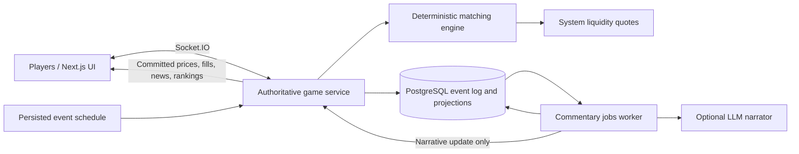

# Architecture and repository structure

Read when bootstrapping the workspace, choosing dependencies, creating packages/services, or changing service boundaries or hosting.

Source: [PROJECT_SPEC.md](../../PROJECT_SPEC.md), §7, baseline version 1.0. The numbered specification sections below are reproduced verbatim from the human reference; routing notes above them are navigation aids.

For delivery order and setup completion, read [implementation](implementation.md). For database design, read [persistence](persistence.md). For deployment targets and observability, read [operations](operations.md).

Verification: AC-12, AC-14, AC-15, AC-18; also the MVP definition of done in implementation.md. Read the exact cases in [verification](verification.md); this list is a starting point, not a replacement for checking affected behavior.

[Spec index](README.md) · [Agent instructions](../../AGENTS.md)

---

## 7. Technical architecture

These are proposed technology choices. Choose and pin supported versions when implementation begins.

| Component | MVP choice | Responsibility |
| --- | --- | --- |
| Web app | Next.js, React, TypeScript | Lobby, dashboard, charts, results |
| Game service | Long-running Node.js/TypeScript process with Socket.IO | Sessions, room commands, realtime transport |
| Engine | Framework-independent TypeScript package | Validation, matching, settlement, deterministic reducers |
| Persistence | PostgreSQL | Sessions, round configuration, event log, projections |
| Event scheduler | Game-service timer backed by persisted deadlines | Apply due events exactly once |
| Commentary worker | Separate worker using a PostgreSQL jobs table | Bounded LLM calls, retries, template fallback |
| Shared schemas | Runtime-validated TypeScript schemas | HTTP/WebSocket contracts and event versions |
| Later scaling | Redis and a dedicated queue if needed | Multi-instance fan-out, presence, job coordination |

Redis is optional infrastructure for later scaling. It is not the source of truth and is not required to operate one MVP room. The game service requires a host that supports persistent WebSocket connections; it should not rely on short-lived request handlers for its clock or in-memory room ownership.



### Suggested repository structure

```text
apps/web/                 Next.js frontend
apps/game-server/         HTTP, Socket.IO, room orchestration
apps/commentary-worker/   Narration jobs and provider adapter
packages/engine/          Pure market logic and event reducers
packages/contracts/       Shared schemas and protocol types
packages/database/        Schema, migrations, persistence helpers
packages/game-content/    Assets, event catalog, templates, rules
tests/integration/        Transaction, reconnect, restart coverage
tests/e2e/                Complete multiplayer round coverage
```
